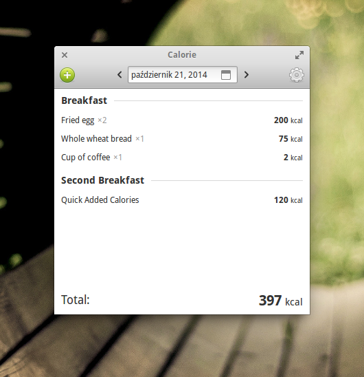

# Calorie

Calorie was an alpha-stage calorie tracker for elementary OS, written in 2013,
retired in 2014.

  

## Other screenshots

- [Adding food diary entry](media/screenshots/adding-entry.png)
- [Customizing meal names](media/screenshots/customizing-meal-names.png)

## Techonology

- **Vala** language w/ **Libgee** collection library
- **GTK 3** GUI toolkit with **Granite** extension
- **SQLite** database
- **CMake** build system

## What used to be the TODO list

- Proper release
- i18n
- Daily/weekly/monthly goals
- Saving predefined meals
- Calorie intake history chart
- Integration with [USDA National Nutrient Database for Standard Reference](http://www.ars.usda.gov/Services/docs.htm?docid=8964)
- …

## Installation

Note: The following instructions were compiled in 2013.

### Dependencies

- valac
- libgee-0.8-dev
- libgtk-3.0-dev
- libgranite-dev
- libsqlite3-dev

### Compilation

Refer to the
[`build_and_run_local.sh`](https://github.com/fauu/Calorie/blob/master/build_and_run_local.sh)
bash script.

You might need to create `~/.local/share/calorie` directory as a temporary fix
if the application reports that it has failed to create the database.

## License

See the [COPYING](https://github.com/fauu/Calorie/blob/master/COPYING) file.
